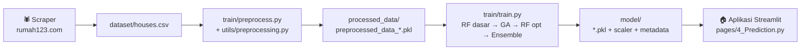

# 🏠 Implementasi Fuzzy Logic dan Optimasi Algoritma Genetika pada Random Forest untuk Prediksi Harga Rumah di Kota Yogyakarta

Sistem prediksi harga rumah untuk wilayah **Kota Yogyakarta** yang menggabungkan tiga pendekatan:

- **🔍 Fuzzy Logic (scikit-fuzzy)** — mengubah atribut kualitatif properti (kualitas area, kualitas ruang, fasilitas carport) menjadi skor numerik yang menjadi fitur model.
- **🧬 Algoritma Genetika** — optimasi hyperparameter Random Forest secara otomatis (tournament selection, crossover aritmetika, mutasi gaussian adaptif, elitisme, early stopping).
- **🌲 Random Forest & Ensemble** — model utama, lalu dibandingkan dengan tiga varian ensemble (voting, stacking dengan meta-learner Ridge, dan blended berbobot inverse-MAPE).

Data berasal dari scraping listing [rumah123.com](https://www.rumah123.com) area Yogyakarta, dan seluruh sistem dibungkus dalam **aplikasi web interaktif Streamlit** untuk eksplorasi data dan prediksi.

---

## 📈 Performa Model Terkini

Model tersimpan: **Random Forest teroptimasi GA**, dilatih **18 Juni 2025** dari 5.261 baris data hasil preprocessing. Metrik dihitung pada **test set (20%) dalam skala rupiah asli** (setelah inverse log-transform):

| Metrik | Nilai |
|---|---|
| MAPE | **19,23%** |
| R² | **0,839** |
| RMSE | ± Rp 232 juta |
| MAE | ± Rp 123 juta |

Hyperparameter hasil GA: `n_estimators=90`, `max_depth=28`, `min_samples_split=4`, `min_samples_leaf=1`, `max_features=0,624`, `bootstrap=True`.

> ⚠️ **Catatan:** angka-angka pada versi README lama (MAPE 1,11%, R² 99,97%) berasal dari model versi lama yang masih memasukkan fitur turunan harga (`price`, `price_per_m2_*`) — yang menyebabkan *data leakage* dan metrik yang menyesatkan. Pipeline saat ini **mengecualikan semua fitur turunan harga**, sehingga angka di atas mencerminkan kemampuan generalisasi model yang sesungguhnya.

### 🔝 Feature Importance (Top 5)

| Fitur | Kontribusi |
|---|---|
| `fuzzy_quality_score` (fuzzy logic) | 36,7% |
| `total_area` (LT + LB) | 28,6% |
| `LB` (luas bangunan) | 10,6% |
| `building_size_tier` | 4,5% |
| `bathroom` | 2,5% |

Fitur fuzzy hasil scikit-fuzzy terbukti menjadi sinyal prediktif terkuat — inti kontribusi penelitian ini.

---

## 🔄 Arsitektur Pipeline

Pipeline berjalan satu arah: **scrape → preprocess → train → predict**. Antar tahap berkomunikasi melalui artefak file (CSV/PKL/JSON), bukan pemanggilan langsung:



1. **Scrape** — `dataset/dataset-scraper/scraper.py` mengambil listing rumah123.com (Yogyakarta) → `dataset/houses.csv`. Kolom mentah: `title`, `price` (string, mis. "Rp 1,5 Miliar"), `bedroom`, `bathroom`, `carport`, `LT`/`LB` (string "150 m²"), `location` ("Kecamatan, Kabupaten"), `updated` ("3 hari lalu").
2. **Preprocessing** — `train/preprocess.py` (CLI) memanggil fungsi kanonik `preprocess_data()` di `utils/preprocessing.py`: parsing string harga/luas/tanggal relatif → split lokasi → buang judul hotel/kost, dedup, buang listing >60 hari, filter kota → imputasi median → removal outlier (IQR + z-score) → feature engineering → **fuzzy logic** → label encoding kecamatan (mapping disimpan ke `reports/encoder_mappings.json`). Output: pickle + CSV + metadata JSON di `processed_data/`.
3. **Training** — `train/train.py` memuat pickle preprocessing terbaru, membuang outlier harga tambahan, mentransformasi target `log1p(price)`, membangun **24 fitur** (tanpa fitur turunan harga), men-standardisasi fitur (`model/feature_scaler.pkl`), lalu berurutan: RF dasar → optimasi GA → RF teroptimasi → tiga ensemble. Model terbaik disimpan ke `model/`.
4. **Prediksi** — aplikasi Streamlit memuat model + scaler, mereplikasi 24 fitur yang sama dari input pengguna, memprediksi dalam ruang log, lalu mengembalikan ke rupiah dengan `np.expm1`.

---

## 📂 Struktur Proyek

```
house-price-prediction/
├── Home.py                          # Entry point aplikasi Streamlit
├── requirements.txt                 # Dependensi Python
├── dataset/
│   ├── houses.csv                   # Dataset mentah hasil scraping
│   └── dataset-scraper/
│       ├── scraper.py               # Scraper rumah123.com
│       ├── ua.txt                   # Daftar User-Agent
│       └── README.md                # Dokumentasi scraper
├── pages/                           # Halaman aplikasi Streamlit
│   ├── 1_Dataset.py                 # EDA dataset
│   ├── 2_Preprocessing.py           # Ringkasan hasil preprocessing
│   ├── 3_Model.py                   # Statistik & riwayat training
│   └── 4_Prediction.py              # Form prediksi harga
├── train/
│   ├── preprocess.py                # CLI wrapper preprocessing
│   ├── train.py                     # Script training utama (RF → GA → ensemble)
│   ├── rf_model.py                  # Training & evaluasi Random Forest
│   ├── ga_optimizer.py              # Implementasi Genetic Algorithm
│   └── ensemble_model.py            # Voting / stacking / blended ensemble
├── utils/
│   ├── preprocessing.py             # Fungsi preprocessing kanonik + fuzzy logic
│   └── helper.py                    # Helper lama (tidak dipakai pipeline)
├── processed_data/                  # Artefak preprocessing (pkl/csv/json)
├── model/
│   ├── optimized_rf_model.pkl       # RF teroptimasi (dipakai app prediksi)
│   ├── best_stacking_ensemble.pkl   # Ensemble terbaik
│   ├── feature_scaler.pkl           # StandardScaler fitur
│   ├── optimized_rf_model_metadata.json / .txt
│   └── evaluation/                  # Plot evaluasi & feature importance
├── reports/
│   ├── encoder_mappings.json        # Mapping encoding kecamatan
│   └── preprocessing_report.json
└── logs/                            # Log preprocessing & training
```

---

## 🚀 Instalasi dan Penggunaan

### Prasyarat

- Python 3.10+ (proyek dikembangkan & diuji pada 3.10–3.13)
- pip

### Langkah Instalasi

```bash
# 1. Clone repository
git clone 
cd house-price-prediction

# 2. Buat dan aktifkan virtual environment
python -m venv venv
venv\Scripts\activate        # Windows
# source venv/bin/activate   # macOS/Linux

# 3. Install dependensi
pip install -r requirements.txt
```

### Menjalankan Pipeline Lengkap

**Urutan wajib: preprocess → train → app.** Semua perintah dijalankan dari root proyek.

```bash
# 1. Preprocessing dataset mentah → processed_data/ + reports/
python train/preprocess.py --input dataset/houses.csv --city Yogyakarta
# --input dan --city opsional; default: dataset/houses.csv, "Yogyakarta"

# 2. Training lengkap: base RF → optimasi GA → RF teroptimasi → ensemble → simpan model
python train/train.py

# 3. Jalankan aplikasi Streamlit
streamlit run Home.py
```

Lalu buka `http://localhost:8501` di browser.

> ⚠️ **Catatan penting:**
> - `streamlit run Home.py` **harus dijalankan dari root proyek** — halaman di `pages/` memakai path relatif (mis. `glob "processed_data/..."`).
> - `train/train.py` **tidak punya CLI argument** (penyebutan `--use-ga-optimization` pada dokumentasi lama sudah usang; GA selalu dijalankan). Jika file preprocessing tidak ditemukan, skrip memanggil `input()` interaktif — selalu jalankan preprocessing dulu.
> - Jika hanya ingin memakai aplikasi dengan model yang sudah tersimpan di `model/`, langkah 1–2 bisa dilewati.

### 🕷️ Menjalankan Scraper (opsional, untuk data baru)

```bash
cd dataset/dataset-scraper
python scraper.py     # → ../dataset/houses.csv
```

Scraper menelusuri seluruh halaman listing Yogyakarta dengan penanganan rate-limit (HTTP 429) otomatis. Butuh dependensi tambahan `beautifulsoup4` dan file `ua.txt` berisi daftar User-Agent. Selengkapnya lihat [dataset-scraper/README.md](dataset/dataset-scraper/README.md). Gunakan secara etis dan sesuai TOS situs.

### 📦 Dependensi Utama

| Paket | Fungsi |
|---|---|
| `streamlit` | Framework aplikasi web |
| `scikit-learn` | Random Forest, ensemble, evaluasi |
| `scikit-fuzzy` | Sistem fuzzy logic |
| `pandas` / `numpy` | Manipulasi data & komputasi numerik |
| `matplotlib` / `seaborn` / `plotly` | Visualisasi |
| `scipy` | Komputasi ilmiah |
| `tqdm` / `colorama` | Progress bar & warna terminal |
| `networkx` | Algoritma graf |
| `beautifulsoup4` *(untuk scraper)* | Parsing HTML rumah123.com |

---

## 🔬 Metodologi

### 🧬 Genetic Algorithm untuk Hyperparameter Tuning

Konfigurasi pada `train/train.py`:

| Parameter | Nilai |
|---|---|
| Ukuran populasi | 20 |
| Generasi maksimum | 10 (early stopping setelah 3 generasi tanpa perbaikan) |
| Mutation rate | 0,2 |
| Seleksi | Tournament |
| Crossover | Aritmetika |
| Mutasi | Gaussian adaptif |
| Elitisme | Ya |
| Validasi fitness | 5-fold cross-validation |
| Fungsi fitness | Komposit MAPE/R²/RMSE/MAE, dihitung di skala rupiah asli (setelah `expm1`) |

Ruang pencarian (`param_bounds`): `n_estimators` 50–200, `max_depth` 5–30, `min_samples_split` 2–20, `min_samples_leaf` 1–10, `max_features` 0,1–1,0.

### 🔍 Sistem Fuzzy Logic (scikit-fuzzy)

`utils/preprocessing.py:create_fuzzy_systems()` membangun 4 sistem fuzzy:

1. **Kategorisasi harga** — very_low → very_high (dipakai saat preprocessing, bukan fitur model).
2. **Kualitas ruang** — fuzzifikasi jumlah kamar tidur × kamar mandi.
3. **Kualitas area** — fuzzifikasi luas tanah (LT) × luas bangunan (LB).
4. **Evaluasi carport** — skor fasilitas parkir.

Hasilnya menjadi fitur `fuzzy_area_quality` dan `fuzzy_quality_score` (rata-rata metrik fuzzy) — fitur terpenting pada model akhir (36,7% kontribusi). Fungsi yang sama dipanggil ulang saat prediksi satu rumah agar nilai fuzzy input konsisten dengan saat training.

### 📐 Target Log-Transform (kritis)

Semua training memakai target `y = log1p(price)`; evaluasi, fitness GA, dan halaman prediksi mengembalikan ke skala rupiah dengan `np.expm1()`. Model hasil `train/train.py` menandai dirinya dengan atribut `_is_log_transformed = True`. Jika salah satu sisi (training/evaluasi/prediksi) diubah, sisi lain harus tetap konsisten — mencampur skala log dan rupiah menghasilkan metrik/prediksi yang salah secara diam-diam.

### 🧮 Daftar 24 Fitur Model

Fitur dasar: `bedroom`, `bathroom`, `LT`, `LB`, `kecamatan_encoded`, `kabupaten_kota_encoded`
Fitur turunan luas: `building_efficiency`, `total_area`, `area_ratio`, `area_ratio_squared`, `land_utilization`, `outdoor_space`, `outdoor_ratio`, `land_size_tier`, `building_size_tier`
Fitur ruang: `total_rooms`, `room_per_area`, `room_density`, `room_density_squared`, `space_efficiency`, `bedroom_bathroom_ratio`, `room_balance`
Fitur temporal & fuzzy: `listing_age_days`, `fuzzy_quality_score`

**Semua fitur turunan harga (`price`, `price_per_m2_*`) sengaja dikecualikan** untuk mencegah data leakage.

---

## 🎪 Aplikasi Streamlit

| Halaman | Isi |
|---|---|
| **Home** | Ringkasan proyek dan navigasi |
| **1_Dataset** | EDA: distribusi harga, luas, lokasi |
| **2_Preprocessing** | Ringkasan tahapan & hasil preprocessing |
| **3_Model** | Statistik model, metrik, riwayat training |
| **4_Prediction** | Form input (LT, LB, kamar, kecamatan, dll.) → prediksi harga dalam rupiah |

Halaman prediksi memuat `optimized_rf_model.pkl` + `feature_scaler.pkl` (dengan fallback kalkulasi heuristik jika model gagal dimuat), membaca encoding kecamatan dari `reports/encoder_mappings.json`, dan menampilkan prediksi beserta penjelasan fitur.

---

## 🚨 Limitasi

- **Scope geografis**: model dikhususkan untuk Kota Yogyakarta dan sekitarnya.
- **Data currency**: dataset merupakan snapshot hasil scraping (artefak training terakhir: Juni 2025); harga properti berubah seiring waktu — jalankan ulang scraper + pipeline untuk data segar.
- **Tipe properti**: rumah residensial (hotel/kost disaring saat preprocessing; bukan apartemen/komersial).
- **Akurasi real-world**: MAPE test set ±19% — realistis untuk data tanpa fitur bocor, tapi bisa bervariasi pada listing baru.
- **Metrik** dihitung di skala rupiah asli, bukan di ruang log.

---

## 📚 Referensi

- Zadeh, L.A. (1965). *Fuzzy sets*. Information and Control.
- Breiman, L. (2001). *Random forests*. Machine Learning.
- Holland, J.H. (1992). *Adaptation in Natural and Artificial Systems*. MIT Press.

---

## 📞 Kontak

👨‍💻 **Developer**: 

🐛 **Issues**: [GitHub Issues](https://github.com/FjrREPO/house-price-prediction/issues)

---

🏠 *"Prediksi harga rumah yang cerdas untuk masa depan properti yang lebih baik"*
